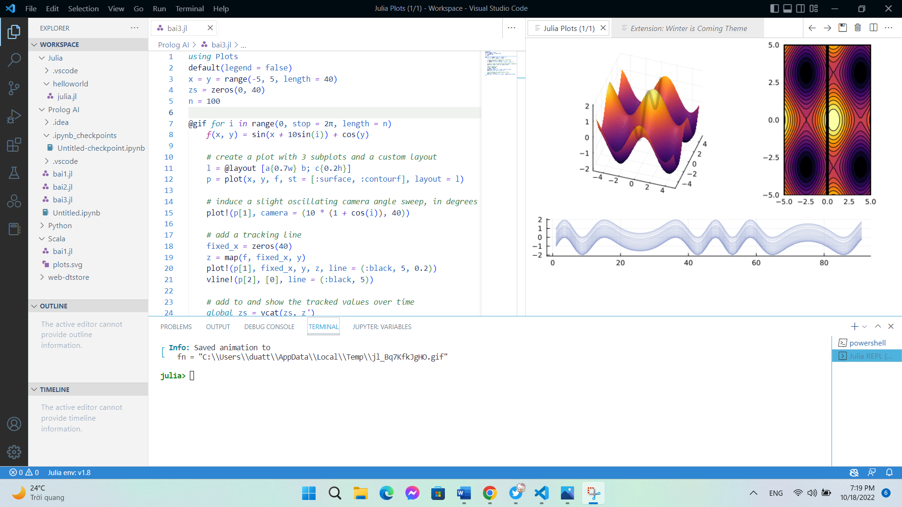

<a>🎄[ THE JULIA PROGRAMMING LANGUAGE – THE FUTURE OF SCIENTIFIC COMPUTING ]🎄</a>

🎄[ THE JULIA PROGRAMMING LANGUAGE – THE FUTURE OF SCIENTIFIC COMPUTING ]🎄
🎯On 14 February 2012  – Đánh dấu sự ra đời của ngôn ngữ lập trình Julia❤️
🫧Sự ra đời của Julia đã đem đến làn gió mới ở giới công nghệ trong các lĩnh vực tính toán khoa học (Science Computing or Data Science)🫧
👉👈Julia là một ngôn ngữ lập trình mã nguồn mở và miễn phí được sử dụng rộng rãi trong tính toán khoa học hay khoa học dữ liệu. Với các tính năng như đánh máy tùy chọn, đa điều phối và hiệu suốt tốt có được bằng cách sử dụng tính năng Type Inference và cơ chế biên dịch Just-In-Time (JIT) được xây dựng trên nền tảng bằng LLVM, code Julia sẽ được dịch trực tiếp thành mã máy, do đó tốc độ xử có thể so sánh bằng với C hay C++🫶
👉Julia được ra đời với mục đich lớn lao là giải quyết các vấn đề mà các ngôn ngữ như C, C++, Fortran, Matlab, R hay python chưa làm được trong các lĩnh vực trên như:
•	C, C++, Fortran (static): tốc độ nhanh nhưng việc phát triển xây dựng các mô hình tính toán quá phức tập , tốn thời gian
•	Matlab, R: không thích hợp cho phát triển xây dựng các mô hình lớn dù có support đầy đủ tính năng, hay hàm cần thiết nhưng tốc độ xử lý lại khá chậm. 
•	Python: là một Interpreter Language nhưng tốc độ xử lí cũng khá chậm mặc dù có thể khắc phục với việc sử dụng các thư viện với những hàm tính toán được viết bằng C (Numpy,…). Trong tương lai khi mà lượng data cần xử lý ngày càng lớn thì các tính năng quan trọng như “parallel computing” hay “concurrency” của Python còn khá hạn chế là một bài toán khó đặt ra với Python.
🎗️Sự ra đời của Julia là sự kết hợp các ưu điểm của nhiều ngôn ngữu lập trình trên như thao tác nhanh như C, C++, Fortran hay hiệu năng cao như Python, Matlab hay R với nhiều tính năng nổi bật như user-defined type, multiple dispatching, metaprogramming, parallel computing hay concurrency. Julia được đánh giá rất cáo trong ngành khoa học máy tính bởi các chức năng nổi trội, cùng khả năng cạnh tranh mạnh mẽ cùng các ngôn ngữ lập trình lâu đời trước đó.
--------------------------------------------
🎄[ THE JULIA PROGRAMMING LANGUAGE: THE FUTURE OF SCIENTIFIC COMPUTING ]🎄
🎢When looking at programming languages for data science, Python reigns supreme. Python and R rule the data world, casting a shadow on similar languages.🎢
✨But one language has distinguished itself from the pack and has slowly been moving towards the light. That language is Julia. Despite its young age, Julia enthusiasts are already calling it the “future language” of Data Science, Science Computing and AI✨
❤️Julia is am innovative new open-source programming language for high-level, high-performance numerical computing. Julia combines the general-purpose breadth and extensibility of Python, the ease-of-use and numeric focus of Matlab, the speed of C and Fortran, and the metaprogramming power of Lisp. Julia uses Type Inference and Just-In-Time (JIT) compilation to compile high-level user code to machine code on the fly. A rich set of numeric types and extensive numerical libraries are built-in. As a result, Julia is competitive with Matlab for interactive graphical exploration and with C and Fortran for high-performance computing. This talk interactively demonstrates Julia’s numerical features and benchmarks Julia against C, C++, Fortran, Matlab and Python on a spectral time-stepping algorithm for nonlinear partial differential equation. The Julia code is nearly as compact as Matlab and nearly as fast as Fortran❤️
Github: https://github.com/.../blob/Main/Introduction_Julia.md
Cre: Tran Van Duat
Cre: Gibson, John
#Julia_and_python_for_beginners
#Julia_language
#Python_language

 
